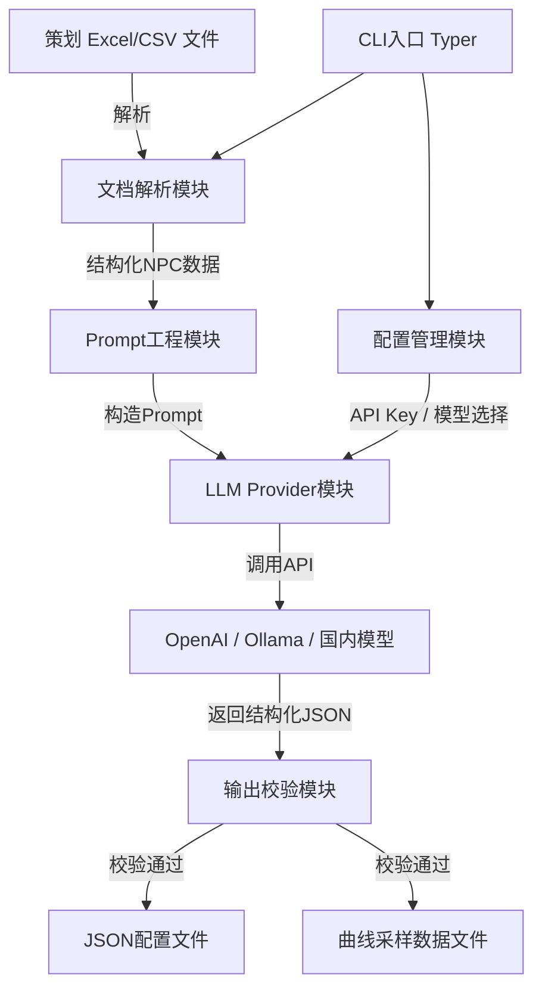
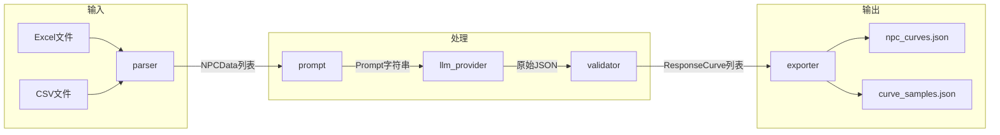

## 产品概述

一个面向游戏策划的Python CLI工具，能够解析策划编写的Excel/CSV需求文档（包含NPC名称、性格标签、行为偏好、自然语言设计意图等），通过大语言模型（LLM）自动生成效用AI（Utility AI）中的响应曲线（Response Curve）类型与参数，最终输出为可供游戏引擎或可视化工具使用的JSON配置文件。工具支持多种LLM模型（OpenAI、Ollama本地模型、国内模型等）灵活切换，降低策划手动调参的成本。

## 核心功能

### 1. Excel/CSV 文档解析

- 支持读取 `.xlsx` 和 `.csv` 格式的策划需求文档
- 自动识别关键列：NPC名称、性格标签、行为偏好、设计意图（自然语言描述）
- 对缺失字段或格式异常进行校验并给出友好提示

### 2. LLM 驱动的响应曲线生成

- 将每个NPC的性格描述与设计意图组装为结构化Prompt，发送给LLM
- LLM返回结构化的响应曲线配置，包括：
- 曲线类型：线性（Linear）、S型（Sigmoid）、指数（Exponential）、对数（Logarithmic）、二次（Quadratic）等
- 曲线参数：斜率（slope）、偏移（offset）、指数（exponent）、中点（midpoint）等
- 对LLM输出进行JSON Schema校验，确保结果合规

### 3. 多LLM模型支持与切换

- 通过CLI参数或配置文件指定LLM提供商和模型
- 内置支持：OpenAI API、Ollama本地模型、国内主流模型（如通义千问、智谱等）
- 统一的Provider抽象接口，便于扩展新模型

### 4. JSON 配置文件输出

- 输出标准化JSON配置文件，包含每个NPC的所有响应曲线定义
- 同时输出曲线采样数据文件（用于外部可视化工具绘制曲线图）
- 支持指定输出目录和文件命名规则

### 5. CLI 交互体验

- 提供清晰的命令行帮助信息
- 支持 `generate` 主命令进行曲线生成、`validate` 命令校验输出文件
- 支持 `--verbose` 模式查看详细处理日志，便于调试Prompt与LLM响应

## 技术栈

- **语言**: Python 3.10+
- **CLI框架**: Typer（基于Click，提供类型提示友好的CLI开发体验）
- **Excel解析**: openpyxl（.xlsx）、内置csv模块（.csv）
- **LLM调用**: litellm（统一多模型调用接口，支持OpenAI、Ollama、国内模型等）
- **数据校验**: Pydantic v2（输入数据建模与LLM输出JSON Schema校验）
- **配置管理**: python-dotenv（环境变量管理API Key等敏感信息）
- **日志**: Python标准logging + Rich（美化CLI输出）
- **包管理**: pyproject.toml + pip

## 技术架构

### 系统架构



### 模块划分

| 模块 | 职责 | 关键依赖 |
| --- | --- | --- |
| **CLI入口** (`cli.py`) | 命令注册、参数解析、流程编排 | Typer, Rich |
| **文档解析模块** (`parser.py`) | 读取Excel/CSV，提取NPC数据 | openpyxl, csv |
| **Prompt工程模块** (`prompt.py`) | 根据NPC属性构造结构化Prompt | Pydantic |
| **LLM Provider模块** (`llm_provider.py`) | 统一调用不同LLM的抽象层 | litellm |
| **输出校验模块** (`validator.py`) | 校验LLM返回的JSON结构 | Pydantic |
| **输出生成模块** (`exporter.py`) | 生成最终JSON配置和曲线采样数据 | json, math |
| **配置管理模块** (`config.py`) | 管理API Key、模型配置、默认参数 | python-dotenv |


### 数据流



## 实现细节

### 核心目录结构

```
utility-design-agent/
├── src/
│   └── utility_design_agent/
│       ├── __init__.py
│       ├── cli.py              # Typer CLI入口与命令定义
│       ├── parser.py           # Excel/CSV文档解析
│       ├── prompt.py           # Prompt模板与构造逻辑
│       ├── llm_provider.py     # LLM统一调用层（基于litellm）
│       ├── validator.py        # LLM输出JSON校验
│       ├── exporter.py         # JSON配置与曲线数据导出
│       ├── config.py           # 配置加载与管理
│       └── models.py           # Pydantic数据模型定义
├── prompts/
│   └── response_curve.txt      # Prompt模板文件
├── examples/
│   └── sample_npcs.xlsx        # 示例策划文档
├── tests/
│   ├── __init__.py
│   ├── test_parser.py
│   ├── test_prompt.py
│   └── test_validator.py
├── pyproject.toml              # 项目配置与依赖声明
├── .env.example                # 环境变量示例
└── README.md
```

### 关键数据结构

**NPCData**: 从Excel解析出的单个NPC原始数据，包含名称、性格标签列表、行为偏好列表以及策划撰写的自然语言设计意图。

```python
from pydantic import BaseModel

class NPCData(BaseModel):
    name: str
    personality_tags: list[str]       # 如 ["胆小", "贪婪"]
    behavior_preferences: list[str]   # 如 ["远程攻击", "拾取物品"]
    design_intent: str                # 自然语言描述
```

**ResponseCurve**: LLM生成的单条响应曲线定义，包含该曲线关联的行为名称、曲线类型枚举、以及具体参数字典。

```python
from enum import Enum

class CurveType(str, Enum):
    LINEAR = "linear"
    SIGMOID = "sigmoid"
    EXPONENTIAL = "exponential"
    LOGARITHMIC = "logarithmic"
    QUADRATIC = "quadratic"

class ResponseCurve(BaseModel):
    behavior: str
    curve_type: CurveType
    parameters: dict[str, float]  # slope, offset, exponent, midpoint等
    input_min: float = 0.0
    input_max: float = 1.0
```

**NPCCurveConfig**: 单个NPC完整的曲线配置输出，包含NPC基础信息及其所有行为对应的响应曲线列表。

```python
class NPCCurveConfig(BaseModel):
    npc_name: str
    personality_tags: list[str]
    curves: list[ResponseCurve]
```

**LLMProviderConfig**: LLM提供商配置，用于统一管理不同模型的调用参数、API地址和密钥。

```python
class LLMProviderConfig(BaseModel):
    provider: str          # "openai", "ollama", "zhipu" 等
    model: str             # 具体模型名称
    api_base: str | None = None
    api_key: str | None = None
    temperature: float = 0.7
    max_tokens: int = 2000
```

### 技术实现方案

#### 1. Prompt工程策略

- **问题**: 需要让LLM根据模糊的性格描述生成精确的数学曲线参数
- **方案**: 采用结构化Prompt + Few-shot示例 + JSON Mode输出约束
- **关键步骤**:

1. 在Prompt中明确定义所有可用的曲线类型及其参数含义
2. 提供2-3个标准Few-shot示例（如"胆小"对应Sigmoid曲线的具体参数）
3. 要求LLM以严格JSON格式输出，并通过litellm的JSON Mode强制结构化返回
4. 对LLM返回的JSON进行Pydantic校验，不合规则自动重试（最多3次）

#### 2. 多LLM Provider统一调用

- **问题**: 需要支持多种LLM且接口各异
- **方案**: 使用litellm作为统一抽象层
- **关键步骤**:

1. 通过litellm的completion接口统一调用，传入 `model` 参数即可切换（如 `gpt-4o`, `ollama/llama3`, `zhipu/glm-4`）
2. config.py 从 `.env` 和CLI参数加载Provider配置
3. 对不同Provider的错误进行统一异常处理与重试

#### 3. 曲线采样数据生成

- **问题**: 需要输出可供外部工具可视化的曲线数据
- **方案**: 根据曲线类型和参数，在 [input_min, input_max] 区间内采样生成数据点
- **关键步骤**:

1. 为每种CurveType实现对应的数学函数（sigmoid、exponential等）
2. 在区间内均匀采样100个点，计算输出值
3. 将采样数据以JSON数组形式输出，包含 `x` 和 `y` 值

## 技术考量

### 日志

- 使用Python标准logging模块，结合Rich的Console输出美化CLI日志
- `--verbose` 模式下输出Prompt全文和LLM原始响应，便于策划和开发调试

### 性能优化

- 对多个NPC采用异步并发调用LLM（使用asyncio + litellm的async接口）
- 支持批量处理时的进度条显示（Rich progress bar）

### 错误处理

- LLM返回格式不合规时自动重试，最多3次，每次在Prompt中追加纠正提示
- Excel列名不匹配时给出清晰的列名映射建议
- API Key缺失或网络超时给出明确错误信息

## Agent Extensions

### Integration

- **anydev**
- 用途: 将构建完成的Python CLI工具部署至腾讯云开发环境，便于团队成员远程使用和测试
- 预期结果: 项目成功部署至AnyDev云研发环境，可在云端运行CLI命令

### Skill

- **skill-creator**
- 用途: 在项目完成后，创建一个skill来封装本工具的使用方法和最佳实践（如Prompt模板编写规范、曲线类型选择指南等），方便后续复用
- 预期结果: 生成一个可复用的skill定义，记录utility-design-agent的核心用法与扩展指南