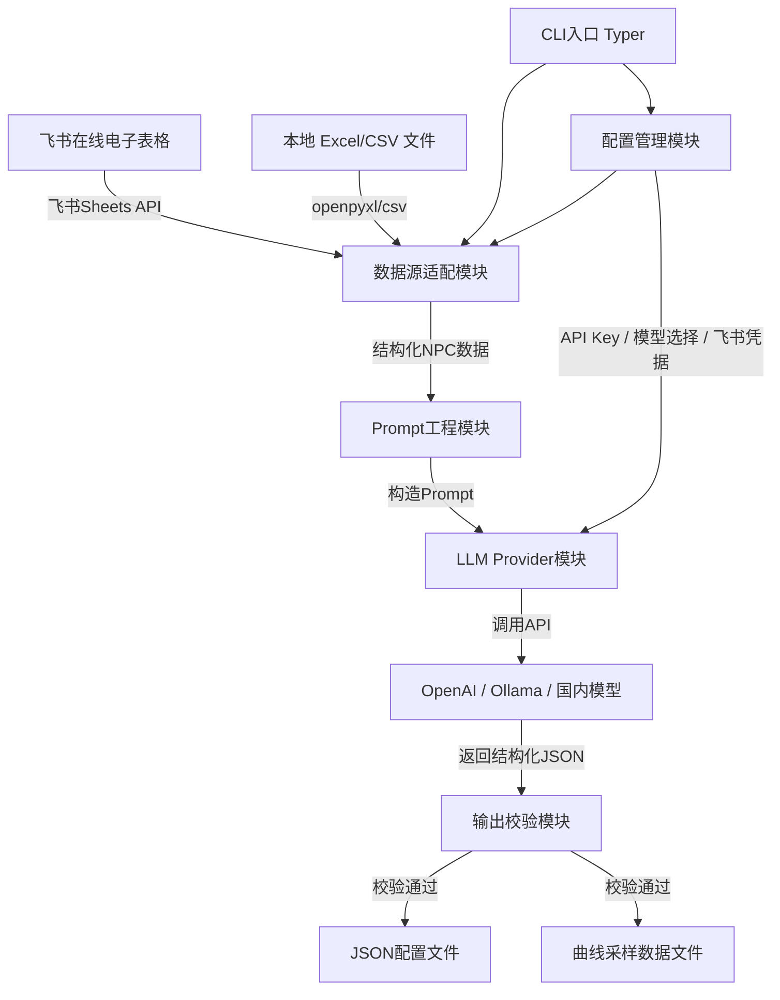
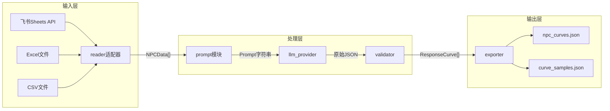

## 产品概述

一个面向游戏策划的 Python CLI 工具，优先通过飞书开放平台 API 在线读取策划维护的飞书电子表格，同时支持本地 Excel(.xlsx)/CSV 文件作为备选输入源。工具解析表格中的 NPC 性格设计数据（名称、性格标签、需求、设计意图等），通过大语言模型（LLM）自动生成效用 AI 响应曲线（Response Curve）的类型与参数，最终输出标准化 JSON 配置文件和曲线采样数据文件。支持多种 LLM 模型灵活切换，降低策划手动调参成本。

## 核心功能

### 1. 飞书在线电子表格读取（优先数据源）

- 通过飞书开放平台 Sheets API 在线读取策划维护的电子表格
- 使用 App ID / App Secret 获取 tenant_access_token 进行认证
- 通过 spreadsheetToken 和 sheetId 精确定位目标表格和工作表
- 自动识别关键列：NPC名称、性格标签、需求、设计意图
- 支持 CLI 参数传入飞书凭据和表格定位信息

### 2. 本地 Excel/CSV 文档解析（备选数据源）

- 支持读取 `.xlsx` 和 `.csv` 格式的本地策划文档
- 与飞书数据源共享同一套列识别与校验逻辑
- 对缺失字段或格式异常进行校验并给出友好提示

### 3. LLM 驱动的响应曲线生成

- 将每个 NPC 的性格描述与设计意图组装为结构化 Prompt，发送给 LLM
- LLM 返回结构化的响应曲线配置，包括曲线类型（线性、S型、指数、对数、二次等）和曲线参数（斜率、偏移、指数、中点等）
- 对 LLM 输出进行 JSON Schema 校验，不合规时自动重试

### 4. 多 LLM 模型支持与切换

- 通过 CLI 参数或 .env 配置文件指定 LLM 提供商和模型
- 内置支持 OpenAI API、Ollama 本地模型、国内主流模型
- 基于 litellm 的统一调用抽象，便于扩展新模型

### 5. JSON 配置文件输出

- 输出标准化 JSON 配置文件，包含每个 NPC 的所有响应曲线定义
- 同时输出曲线采样数据文件，供外部可视化工具绘制曲线图
- 支持指定输出目录和文件命名规则

### 6. CLI 交互体验

- 提供 `generate` 主命令（支持 `--source feishu` 或 `--source local` 切换数据源）
- 提供 `validate` 命令校验已生成的输出文件
- 支持 `--verbose` 模式查看详细处理日志，包括 Prompt 与 LLM 原始响应
- 使用 Rich 美化终端输出与进度显示

## 技术栈

- **语言**: Python 3.10+
- **CLI框架**: Typer（基于 Click，类型提示友好）
- **飞书API**: httpx（异步HTTP客户端，调用飞书开放平台 Sheets API）
- **Excel解析**: openpyxl（.xlsx）、内置 csv 模块（.csv）
- **LLM调用**: litellm（统一多模型调用接口）
- **数据校验**: Pydantic v2（输入建模与LLM输出校验）
- **配置管理**: python-dotenv（环境变量管理）
- **终端美化**: Rich（美化CLI输出、进度条、表格展示）
- **包管理**: pyproject.toml + pip

## 技术架构

### 系统架构



### 模块划分

| 模块 | 职责 | 关键依赖 |
| --- | --- | --- |
| **CLI入口** (`cli.py`) | 命令注册、参数解析、流程编排 | Typer, Rich |
| **飞书数据源** (`feishu_reader.py`) | 飞书API认证、在线表格读取与解析 | httpx |
| **本地数据源** (`local_reader.py`) | 读取本地Excel/CSV文件 | openpyxl, csv |
| **数据源适配器** (`reader.py`) | 统一数据源接口，根据参数选择飞书或本地 | feishu_reader, local_reader |
| **Prompt工程模块** (`prompt.py`) | 根据NPC属性构造结构化Prompt | Pydantic |
| **LLM Provider模块** (`llm_provider.py`) | 统一调用不同LLM的抽象层 | litellm |
| **输出校验模块** (`validator.py`) | 校验LLM返回的JSON结构 | Pydantic |
| **输出生成模块** (`exporter.py`) | 生成最终JSON配置和曲线采样数据 | json, math |
| **数据模型** (`models.py`) | Pydantic数据模型定义 | Pydantic |
| **配置管理模块** (`config.py`) | 管理API Key、模型配置、飞书凭据等 | python-dotenv |


### 数据流



## 实现细节

### 核心目录结构

```
utility-design-agent/
├── src/
│   └── utility_design_agent/
│       ├── __init__.py
│       ├── cli.py                # Typer CLI入口与命令定义
│       ├── reader.py             # 数据源适配器（统一接口）
│       ├── feishu_reader.py      # 飞书开放平台Sheets API读取
│       ├── local_reader.py       # 本地Excel/CSV文件读取
│       ├── prompt.py             # Prompt模板与构造逻辑
│       ├── llm_provider.py       # LLM统一调用层（基于litellm）
│       ├── validator.py          # LLM输出JSON校验
│       ├── exporter.py           # JSON配置与曲线采样数据导出
│       ├── config.py             # 配置加载与管理
│       └── models.py             # Pydantic数据模型定义
├── prompts/
│   └── response_curve.txt        # Prompt模板文件
├── examples/
│   └── sample_npcs.xlsx          # 示例策划文档
├── tests/
│   ├── __init__.py
│   ├── test_feishu_reader.py
│   ├── test_local_reader.py
│   ├── test_prompt.py
│   └── test_validator.py
├── pyproject.toml                # 项目配置与依赖声明
├── .env.example                  # 环境变量示例（含飞书App ID/Secret）
└── README.md
```

### 关键数据结构

**NPCData**: 从飞书或本地文件解析出的单个NPC原始数据，包含名称、性格标签列表、需求列表以及策划撰写的自然语言设计意图。

```python
from pydantic import BaseModel

class NPCData(BaseModel):
    name: str
    personality_tags: list[str]       # 如 ["胆小", "贪婪"]
    needs: list[str]   # 如 ["远程攻击", "拾取物品"]
    design_intent: str                # 自然语言描述
```

**FeishuConfig**: 飞书API连接配置，用于管理应用凭据和表格定位信息。

```python
class FeishuConfig(BaseModel):
    app_id: str
    app_secret: str
    spreadsheet_token: str
    sheet_id: str
```

**ResponseCurve**: LLM生成的单条响应曲线定义。

```python
from enum import Enum

class CurveType(str, Enum):
    LINEAR = "linear"
    SIGMOID = "sigmoid"
    EXPONENTIAL = "exponential"
    LOGARITHMIC = "logarithmic"
    QUADRATIC = "quadratic"

class ResponseCurve(BaseModel):
    behavior: str
    curve_type: CurveType
    parameters: dict[str, float]
    input_min: float = 0.0
    input_max: float = 1.0
```

**NPCCurveConfig**: 单个NPC完整的曲线配置输出。

```python
class NPCCurveConfig(BaseModel):
    npc_name: str
    personality_tags: list[str]
    curves: list[ResponseCurve]
```

**LLMProviderConfig**: LLM提供商配置。

```python
class LLMProviderConfig(BaseModel):
    provider: str          # "openai", "ollama", "zhipu" 等
    model: str
    api_base: str | None = None
    api_key: str | None = None
    temperature: float = 0.7
    max_tokens: int = 2000
```

### 技术实现方案

#### 1. 飞书开放平台 Sheets API 集成

- **问题**: 需要在线读取策划维护的飞书电子表格数据
- **方案**: 使用飞书开放平台的 Sheets API，通过 httpx 发起 HTTP 请求
- **关键步骤**:

1. 使用 App ID 和 App Secret 调用 `https://open.feishu.cn/open-apis/auth/v3/tenant_access_token/internal` 获取 tenant_access_token
2. 使用 token 调用 `https://open.feishu.cn/open-apis/sheets/v2/spreadsheets/{spreadsheetToken}/values/{sheetId}` 读取指定范围的表格数据
3. 解析返回的 JSON 数据，提取行列内容并映射为 NPCData 列表
4. 实现 token 过期自动刷新机制
5. 对API错误（权限不足、表格不存在等）给出清晰提示

#### 2. 数据源适配器模式

- **问题**: 需要统一飞书在线和本地文件两种数据源的调用方式
- **方案**: 采用策略模式，定义统一的 DataReader 协议接口
- **关键步骤**:

1. 定义 `DataReader` Protocol，统一 `read() -> list[NPCData]` 接口
2. `FeishuReader` 和 `LocalReader` 分别实现该接口
3. CLI 根据 `--source` 参数自动选择对应的 Reader 实例
4. 共享同一套列名识别和数据校验逻辑

#### 3. Prompt工程策略

- **问题**: 需要让LLM根据模糊的性格描述生成精确的数学曲线参数
- **方案**: 采用结构化Prompt + Few-shot示例 + JSON Mode输出约束
- **关键步骤**:

1. 在Prompt中明确定义所有可用的曲线类型及其参数含义
2. 提供2-3个标准Few-shot示例（如"胆小"对应Sigmoid曲线的具体参数）
3. 要求LLM以严格JSON格式输出，通过litellm的JSON Mode强制结构化返回
4. 对LLM返回的JSON进行Pydantic校验，不合规则自动重试（最多3次）

#### 4. 多LLM Provider统一调用

- **问题**: 需要支持多种LLM且接口各异
- **方案**: 使用litellm作为统一抽象层
- **关键步骤**:

1. 通过litellm的completion接口统一调用，传入 `model` 参数切换（如 `gpt-4o`, `ollama/llama3`, `zhipu/glm-4`）
2. config.py 从 `.env` 和CLI参数加载Provider配置
3. 对不同Provider的错误进行统一异常处理与重试

#### 5. 曲线采样数据生成

- **问题**: 需要输出可供外部工具可视化的曲线数据
- **方案**: 根据曲线类型和参数，在区间内采样生成数据点
- **关键步骤**:

1. 为每种CurveType实现对应的数学函数
2. 在 [input_min, input_max] 区间内均匀采样100个点
3. 将采样数据以JSON数组形式输出，包含 x 和 y 值

### 集成点

- **飞书开放平台**: Sheets API v2，JSON格式通信，tenant_access_token Bearer认证
- **LLM服务**: 通过litellm统一抽象，支持OpenAI、Ollama、国内模型的HTTP API
- **输出文件**: 标准JSON格式，供游戏引擎或可视化工具消费

## 技术考量

### 日志

- 使用Python标准logging模块，结合Rich Console美化输出
- `--verbose` 模式下输出Prompt全文和LLM原始响应

### 性能优化

- 多NPC采用 asyncio + litellm async 接口并发调用LLM
- Rich progress bar 展示批量处理进度
- 飞书API读取使用 httpx 异步客户端

### 错误处理

- LLM返回格式不合规时自动重试，最多3次，每次追加纠正提示
- 飞书API调用失败时给出清晰错误信息（token过期、权限不足、表格不存在等）
- Excel列名不匹配时给出列名映射建议
- API Key缺失或网络超时给出明确错误提示

### 安全

- 飞书 App Secret、LLM API Key 等敏感信息通过 .env 文件管理，不入库
- .gitignore 中排除 .env 文件

## Agent Extensions

### Integration

- **anydev**
- 用途: 将构建完成的Python CLI工具部署至腾讯云开发环境，便于团队成员远程访问和测试
- 预期结果: 项目成功部署至AnyDev云研发环境，可通过云端运行CLI命令处理飞书表格数据

### Skill

- **skill-creator**
- 用途: 项目完成后，创建一个skill封装本工具的使用方法和最佳实践（如飞书表格配置规范、Prompt模板编写指南、曲线类型选择建议等），方便团队成员和后续项目复用
- 预期结果: 生成一个可复用的skill定义，记录utility-design-agent的核心用法与扩展指南