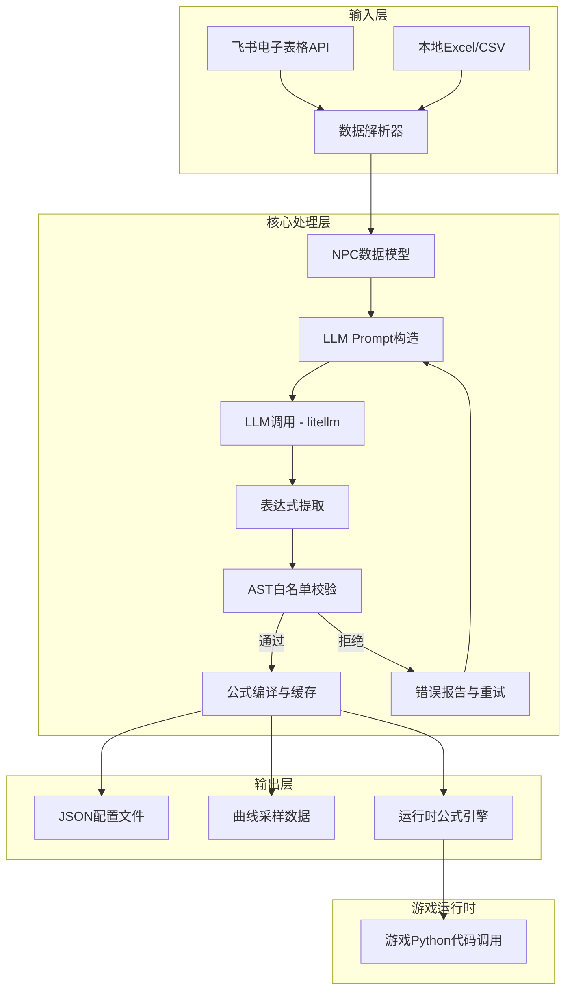
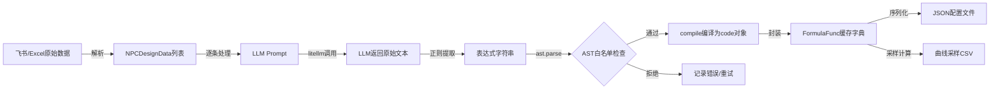

## 产品概述

一个Python CLI工具，用于辅助游戏策划自动化生成NPC效用函数。工具从飞书在线电子表格（优先）或本地Excel/CSV文件中读取NPC性格设计数据，通过LLM（支持多模型切换）将自然语言设计意图自动转化为安全的Python数学表达式字符串，经过AST白名单安全校验后输出为JSON配置文件。生成的公式可在游戏Python环境中直接import调用，性能接近原生。

## 核心功能

1. **飞书电子表格在线读取**：通过飞书开放平台Sheets API读取策划维护的NPC性格设计表格（含NPC名称、性格标签、需求、自然语言设计意图），备选支持本地Excel/CSV文件导入
2. **LLM自动生成效用函数表达式**：将NPC设计意图发送给LLM，自动生成Python数学表达式字符串（如 `1 / (1 + math.exp(-4 * (x - 0.5)))`），支持通过litellm切换多种LLM模型（OpenAI、Claude、本地模型等）
3. **AST白名单安全校验**：对LLM生成的表达式进行ast.parse解析，仅允许数学运算符和math库函数，禁止函数调用、import、属性访问等危险操作，确保表达式在游戏环境中安全执行
4. **JSON配置输出**：将校验通过的公式表达式、曲线元数据（参数范围、采样点等）输出为结构化JSON配置文件，同时生成曲线采样数据文件供可视化或调试使用
5. **运行时公式引擎**：编译后的公式函数对象可被游戏Python代码直接import调用，支持缓存机制，性能接近原生Python函数
6. **CLI交互**：支持命令行参数指定数据源、LLM模型、输出路径等，提供清晰的进度反馈和错误提示

## 技术栈

- **语言**：Python 3.10+
- **CLI框架**：click（命令行参数解析与子命令管理）
- **飞书API**：requests + 飞书开放平台Sheets API（OAuth2 App Token认证）
- **本地文件解析**：openpyxl（Excel）、csv标准库（CSV）
- **LLM调用**：litellm（统一多模型接口，支持OpenAI/Claude/本地模型切换）
- **安全校验**：ast标准库（AST白名单节点检查）
- **配置管理**：pydantic（数据模型校验）、python-dotenv（环境变量）
- **输出格式**：json标准库
- **项目管理**：pyproject.toml（PEP 621标准）

## 技术架构

### 系统架构



### 模块划分

- **data_source模块**：负责飞书API认证与表格读取、本地文件解析，统一输出标准化NPC数据结构
- 依赖：requests, openpyxl
- 接口：`fetch_npc_data(source_config) -> List[NPCDesignData]`

- **llm_generator模块**：构造Prompt、调用LLM生成表达式、解析提取结果
- 依赖：litellm
- 接口：`generate_formula(npc_data, model_name) -> FormulaResult`

- **formula_engine模块**：AST白名单校验、表达式编译、运行时执行与缓存
- 依赖：ast标准库、math标准库
- 接口：`validate_expression(expr_str) -> bool`、`compile_formula(expr_str) -> Callable`、`evaluate(formula_id, x) -> float`

- **output模块**：JSON配置文件生成、曲线采样数据导出
- 接口：`export_config(formulas, output_path)`、`export_samples(formulas, sample_config)`

- **cli模块**：命令行入口、参数解析、流程编排
- 依赖：click

### 数据流



## 实现细节

### 核心目录结构

```
utility-design-agent/
├── pyproject.toml                # 项目配置与依赖声明
├── .env.example                  # 环境变量模板（飞书AppID/Secret、LLM API Key）
├── README.md                     # 项目说明文档
├── src/
│   └── utility_design_agent/
│       ├── __init__.py
│       ├── cli.py                # CLI入口与命令定义
│       ├── config.py             # 配置管理（pydantic Settings）
│       ├── models.py             # 数据模型定义
│       ├── data_source/
│       │   ├── __init__.py
│       │   ├── feishu.py         # 飞书API表格读取
│       │   └── local_file.py     # 本地Excel/CSV读取
│       ├── llm_generator.py      # LLM调用与Prompt管理
│       ├── formula_engine.py     # AST校验、编译、运行时执行
│       └── output.py             # JSON配置与采样数据输出
├── prompts/
│   └── formula_prompt.txt        # LLM Prompt模板
├── tests/
│   ├── __init__.py
│   ├── test_formula_engine.py    # 公式引擎单元测试
│   ├── test_ast_validator.py     # AST校验测试
│   └── test_data_source.py       # 数据源测试
└── output/                       # 默认输出目录（gitignore）
    ├── npc_formulas.json
    └── curve_samples.csv
```

### 关键代码结构

**NPC设计数据模型**：定义从电子表格解析出的NPC策划数据结构，包含名称、性格标签、需求列表以及策划撰写的自然语言设计意图描述。

```python
from pydantic import BaseModel
from typing import List, Optional

class NPCDesignData(BaseModel):
    npc_name: str
    personality_tags: List[str]
    needs: List[str]
    design_intent: str  # 策划的自然语言描述
```

**公式结果模型**：封装LLM生成的单条效用函数完整信息，包含原始表达式字符串、变量名、值域范围、LLM生成的说明文字，以及AST校验是否通过的状态标记。

```python
class FormulaResult(BaseModel):
    npc_name: str
    behavior: str
    expression: str           # 如 "1 / (1 + math.exp(-4 * (x - 0.5)))"
    variable: str             # 默认 "x"
    domain: tuple[float, float]  # 输入值域 (0.0, 1.0)
    description: str          # LLM生成的公式说明
    validated: bool = False
```

**AST白名单校验器**：核心安全组件，遍历AST节点树，仅允许数学运算（BinOp/UnaryOp/Compare）、数字字面量、变量名引用以及math库函数调用，拒绝任何import、exec、eval、属性访问等危险节点。

```python
import ast
import math

ALLOWED_NAMES = {'x', 'math'}
ALLOWED_MATH_FUNCS = {name for name in dir(math) if not name.startswith('_')}
ALLOWED_NODE_TYPES = (
    ast.Expression, ast.BinOp, ast.UnaryOp, ast.Num, ast.Name,
    ast.Load, ast.Add, ast.Sub, ast.Mult, ast.Div, ast.Pow,
    ast.USub, ast.Call, ast.Attribute, ast.Constant,
)

def validate_expression(expr_str: str) -> bool:
    """AST白名单校验，仅允许安全的数学表达式"""
    tree = ast.parse(expr_str, mode='eval')
    for node in ast.walk(tree):
        if not isinstance(node, ALLOWED_NODE_TYPES):
            raise UnsafeExpressionError(f"禁止的AST节点: {type(node).__name__}")
        if isinstance(node, ast.Name) and node.id not in ALLOWED_NAMES:
            raise UnsafeExpressionError(f"禁止的变量名: {node.id}")
        if isinstance(node, ast.Attribute):
            if not (isinstance(node.value, ast.Name) and node.value.id == 'math'
                    and node.attr in ALLOWED_MATH_FUNCS):
                raise UnsafeExpressionError(f"禁止的属性访问: {ast.dump(node)}")
    return True
```

**公式编译与缓存执行**：将校验通过的表达式字符串编译为Python code对象，封装为可调用函数并缓存，供游戏运行时高性能调用。

```python
from typing import Callable, Dict

_formula_cache: Dict[str, Callable[[float], float]] = {}

def compile_formula(expr_str: str) -> Callable[[float], float]:
    """编译表达式为可调用函数，带缓存"""
    if expr_str in _formula_cache:
        return _formula_cache[expr_str]
    validate_expression(expr_str)
    code = compile(expr_str, '<formula>', 'eval')
    def formula_func(x: float) -> float:
        return eval(code, {"__builtins__": {}, "math": math, "x": x})
    _formula_cache[expr_str] = formula_func
    return formula_func
```

### 技术实现方案

#### 飞书API集成

1. **问题**：需要安全认证并稳定读取飞书在线电子表格
2. **方案**：使用飞书开放平台自建应用，通过tenant_access_token认证，调用Sheets API v3读取指定表格范围数据
3. **关键技术**：requests库、OAuth2 App认证流程
4. **实现步骤**：

- 配置飞书App ID/Secret到.env
- 实现token获取与自动刷新
- 调用 `/open-apis/sheets/v3/spreadsheets/:id/sheets/:sheet_id/range` 读取数据
- 将原始数据映射为NPCDesignData模型

5. **测试**：Mock飞书API响应进行单元测试

#### LLM表达式生成

1. **问题**：需要将自然语言设计意图准确转化为数学表达式
2. **方案**：精心设计Prompt模板，约束LLM输出格式，使用litellm统一多模型接口
3. **关键技术**：litellm、Prompt Engineering、结构化输出解析
4. **实现步骤**：

- 设计Prompt模板，包含角色定义、输出格式约束、示例表达式
- 通过litellm.completion()统一调用不同模型
- 正则提取返回文本中的表达式字符串
- 校验失败时自动重试（最多3次）

5. **测试**：使用固定Prompt测试不同模型输出质量

#### AST安全校验

1. **问题**：防止LLM生成包含恶意代码的表达式
2. **方案**：ast.parse解析后遍历节点树，严格白名单校验
3. **关键技术**：ast标准库、节点类型白名单
4. **实现步骤**：

- 定义允许的AST节点类型白名单
- 定义允许的变量名和math函数白名单
- 递归遍历所有节点进行校验
- 提供清晰的校验失败错误信息

5. **测试**：覆盖各种恶意表达式（import、exec、lambda、列表推导等）

## 技术考量

### 安全措施

- AST白名单校验是核心安全机制，必须覆盖所有危险AST节点类型
- eval执行时严格限制`__builtins__`为空字典，仅注入math和x
- 飞书API Token不硬编码，通过环境变量管理
- LLM API Key同样通过环境变量管理

### 性能优化

- 公式编译结果缓存，避免重复compile
- 飞书API支持批量读取范围数据，减少API调用次数
- LLM调用支持批量处理，减少网络往返

### 可扩展性

- litellm抽象层使得新增LLM模型无需修改代码
- 数据源通过统一接口抽象，未来可扩展更多输入源
- JSON配置格式版本化，便于向后兼容

## Agent Extensions

### Integration

- **anydev**
- 用途：将构建完成的CLI工具部署到腾讯云开发环境，便于团队成员远程使用和测试
- 预期结果：项目成功部署到AnyDev云研发环境，可通过远程环境运行CLI命令

### Skill

- **skill-creator**
- 用途：将本项目的AST校验规则和公式引擎使用模式沉淀为可复用的skill，方便后续类似项目参考
- 预期结果：创建一个描述公式引擎安全校验最佳实践的skill文档

### SubAgent

- **code-explorer**
- 用途：在开发过程中探索litellm、飞书API等依赖库的使用模式和接口规范
- 预期结果：获取准确的第三方库接口信息以指导实现