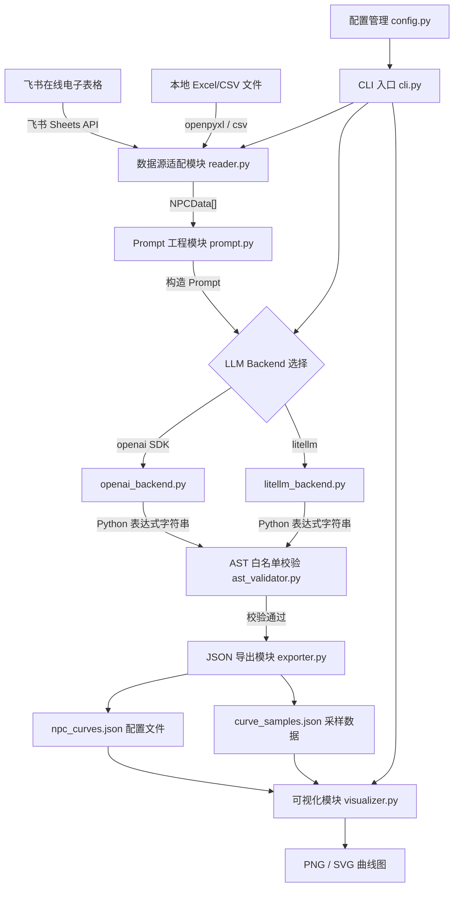
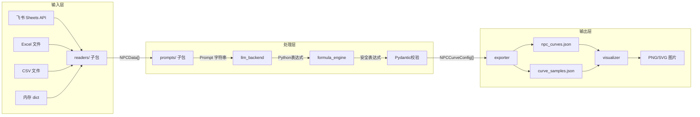

## 产品概述

一个面向游戏策划的 Python 效用函数自动生成库 + CLI 工具。**核心设计原则：Library-First（库优先）**，所有功能模块均可被第三方项目直接 `import` 调用（如 `from utility_design_agent import FormulaEngine, FeishuReader`），CLI 仅作为库之上的薄壳入口。

工具优先从飞书在线电子表格（开放平台 Sheets API）读取策划维护的 NPC 性格设计数据，也支持本地 Excel/CSV 文件作为备选输入。读取数据后，通过大语言模型（LLM）自动生成可执行的 Python 效用函数数学表达式字符串，经 AST 白名单安全校验后输出标准化 JSON 配置文件。同时提供基于 matplotlib 的曲线可视化模块，支持单曲线绘制、多曲线对比和 NPC 全行为汇总图，输出为 PNG/SVG 图片文件。LLM 调用支持原生 OpenAI SDK 和 litellm 两种后端模式，通过 CLI 参数或配置文件灵活切换。

### 架构原则：Library-First 设计

- **每个模块提供独立的编程式 API**，不依赖 CLI 参数或全局状态
- **`__init__.py` 作为公共 API 入口**，显式导出所有核心类和函数，第三方项目可直接 `import`
- **CLI (`cli.py`) 是纯粹的薄壳**，仅负责参数解析和调用库 API，不包含任何业务逻辑
- **配置通过构造函数注入**，而非依赖环境变量（.env 仅作为 CLI 层的便捷手段）
- **所有模块接受 Pydantic 模型或 Python 原生类型作为参数**，不依赖文件路径字符串

**第三方集成示例**：

```python
from utility_design_agent import (
    FormulaEngine, FeishuReader, LocalReader, DictReader,
    create_llm_backend, PromptBuilder, Visualizer,
    NPCData, UtilityFunction, NPCCurveConfig,
)

# 1a. 从飞书读取
reader = FeishuReader(app_id="xxx", app_secret="xxx")
npcs = await reader.read(spreadsheet_token="xxx", sheet_id="xxx")

# 1b. 从本地文件读取
reader = LocalReader()
npcs = reader.read(path="npcs.xlsx")

# 1c. 从内存 dict 直接构建（方便第三方集成）
reader = DictReader()
npcs = reader.read(data=[
    {"name": "哥布林", "personality_tags": ["胆小", "贪婪"],
     "needs": ["逃跑", "拾取"], "design_intent": "..."},
])

# 2. 生成效用函数
backend = create_llm_backend("openai", api_key="xxx", model="gpt-4o")
prompt_builder = PromptBuilder()
engine = FormulaEngine()

for npc in npcs:
    prompt = prompt_builder.build(npc)
    raw = await backend.generate(prompt)
    formula = engine.validate_and_compile(raw)

# 3. 可视化
viz = Visualizer()
fig = viz.plot_npc_summary(npc_config)
fig.savefig("output.png")
```

## 核心功能

### 1. 飞书在线电子表格读取

- 通过飞书开放平台 Sheets API 在线读取策划维护的 NPC 性格设计表
- 使用 App ID / App Secret 获取 tenant_access_token 进行认证
- 自动识别关键列：NPC 名称、性格标签、需求、自然语言设计意图

### 2. 本地 Excel/CSV 文档解析

- 支持 .xlsx 和 .csv 两种格式的本地策划文档
- 与飞书数据源共享统一的数据校验逻辑，对缺失字段给出友好提示

### 2b. Dict 内存数据读取

- 接受 `list[dict]` 直接构建 `NPCData` 列表
- 方便第三方项目从数据库、API 或其他来源获取数据后，直接传入内存 dict 使用，无需落地文件

### 3. LLM 驱动的效用函数表达式生成

- 将 NPC 性格描述与设计意图组装为结构化 Prompt，发送给 LLM
- LLM 返回可执行的 Python 数学表达式字符串（如 `1 / (1 + math.exp(-5 * (x - 0.5)))`）
- 支持两种 LLM 调用后端：原生 openai Python SDK 直连、litellm 统一调用
- 通过 `--llm-backend openai|litellm` 参数或 .env 配置切换后端

### 4. AST 白名单安全校验

- 对 LLM 生成的 Python 表达式进行 AST 解析
- 仅允许白名单内的数学函数和运算符（math.exp、math.log、math.pow、加减乘除幂等）
- 拒绝任何包含函数调用、import、属性访问等危险节点的表达式

### 5. matplotlib 曲线可视化

- 单曲线模式：绘制单个行为的效用函数曲线图
- 多曲线对比模式：在同一坐标系中叠加多条行为曲线
- NPC 全行为汇总模式：为每个 NPC 生成包含所有行为曲线的汇总图
- 输出格式支持 PNG 和 SVG

### 6. JSON 配置文件输出

- 输出包含 formula 表达式字符串、曲线元数据、NPC 信息的标准化 JSON 配置
- 同时输出曲线采样数据文件，供外部工具消费

### 7. CLI 交互体验

- `generate` 命令：指定数据源、LLM 后端，批量生成效用函数
- `validate` 命令：校验已生成的 JSON 配置文件中表达式的安全性
- `visualize` 命令：对已生成的 JSON 配置绘制曲线图
- Rich 美化终端输出与进度显示

## 技术栈

- **语言**: Python 3.10+
- **CLI 框架**: Typer（类型提示友好的 CLI 框架）
- **飞书 API**: httpx（异步 HTTP 客户端，调用飞书开放平台 Sheets API）
- **Excel 解析**: openpyxl（.xlsx）、内置 csv 模块（.csv）
- **LLM 调用**:
- 原生 openai Python SDK（直连 OpenAI 兼容 API）
- litellm（统一多模型调用接口）
- 通过 `--llm-backend` 参数切换
- **数据校验**: Pydantic v2
- **安全校验**: Python ast 标准库（AST 白名单校验）
- **可视化**: matplotlib（曲线绘制，支持 PNG/SVG 输出）
- **配置管理**: python-dotenv
- **终端美化**: Rich
- **测试**: pytest + pytest-asyncio
- **包管理**: pyproject.toml + pip

## 技术架构

### 系统架构



### 模块划分

每个模块均提供独立的编程式 API，配置通过构造函数注入，不依赖全局状态。

| 模块 | 职责 | 编程式 API 入口 | 关键依赖 |
| --- | --- | --- | --- |
| **公共 API** (`__init__.py`) | 显式导出所有核心类/函数 | `from utility_design_agent import ...` | 所有子模块 |
| **CLI 薄壳** (`cli.py`) | 命令行参数解析，调用库 API | 仅 CLI 使用，不被 import | Typer, Rich |
| **数据源子包** (`readers/`) | 统一数据源管理 | `create_reader(source_type, **kwargs)` | — |
| **飞书数据源** (`readers/feishu_reader.py`) | 飞书 API 认证与表格读取 | `FeishuReader(app_id, secret).read()` | httpx |
| **本地数据源** (`readers/local_reader.py`) | 读取本地 Excel/CSV | `LocalReader(path).read()` | openpyxl, csv |
| **Dict 数据源** (`readers/dict_reader.py`) | 内存 dict 直接构建 NPCData | `DictReader().read(data=[...])` | Pydantic |
| **Prompt 子包** (`prompts/`) | Prompt 模板（Python 字符串常量）+ 构造逻辑 | `PromptBuilder().build(npc_data)` | — |
| **LLM 后端** (`llm_backend/`) | 双后端统一调用 | `create_llm_backend("openai", ...)` | openai, litellm |
| **公式引擎** (`formula_engine.py`) | AST 校验 + 编译 + 缓存执行 | `FormulaEngine().validate_and_compile(expr)` | ast, math |
| **导出模块** (`exporter.py`) | JSON 配置与采样数据 | `Exporter(output_dir).export(configs)` | json, math |
| **可视化** (`visualizer.py`) | matplotlib 曲线绘制 | `Visualizer().plot_npc_summary(config)` | matplotlib |
| **数据模型** (`models.py`) | Pydantic 数据结构 | 直接 import 使用 | Pydantic |
| **配置管理** (`config.py`) | API Key、模型配置等 | `AppConfig(api_key=..., model=...)` | python-dotenv |


### 数据流



## 实现细节

### 核心目录结构

```
utility-design-agent/
├── src/
│   └── utility_design_agent/
│       ├── __init__.py              # 公共 API 入口：显式导出所有核心类/函数供第三方 import
│       ├── cli.py                   # Typer CLI 薄壳入口（仅参数解析 + 调用库 API）
│       ├── config.py                # 配置管理（Pydantic Settings，支持构造函数注入 + .env 备选）
│       ├── models.py                # Pydantic 数据模型定义（NPCData, UtilityFunction 等）
│       ├── readers/                 # 数据源子包
│       │   ├── __init__.py          # 统一接口 + 工厂函数 create_reader()
│       │   ├── base.py              # BaseReader 抽象基类
│       │   ├── feishu_reader.py     # 飞书 Sheets API 读取
│       │   ├── local_reader.py      # 本地 Excel/CSV 读取
│       │   └── dict_reader.py       # 内存 dict 直接构建 NPCData
│       ├── prompts/                 # Prompt 子包（Python 字符串常量，可直接 import）
│       │   ├── __init__.py          # 导出 PromptBuilder 和模板常量
│       │   ├── templates.py         # Prompt 模板字符串常量（system_prompt, few_shot 等）
│       │   └── builder.py           # PromptBuilder 构造逻辑
│       ├── llm_backend/
│       │   ├── __init__.py          # 工厂函数 create_llm_backend()
│       │   ├── base.py              # LLMBackend 抽象基类
│       │   ├── openai_backend.py    # 原生 openai SDK 后端
│       │   └── litellm_backend.py   # litellm 统一调用后端
│       ├── formula_engine.py        # AST 白名单校验 + 表达式编译 + 缓存执行
│       ├── exporter.py              # JSON 配置与采样数据导出
│       └── visualizer.py            # matplotlib 曲线可视化模块
├── tests/                           # 测试目录
│   ├── __init__.py
│   ├── conftest.py                  # pytest fixtures（mock LLM、示例 NPCData 等）
│   ├── test_models.py               # 数据模型测试
│   ├── test_readers.py              # 数据源读取测试（DictReader、LocalReader、FeishuReader mock）
│   ├── test_formula_engine.py       # AST 白名单校验 + 表达式编译执行测试
│   ├── test_prompts.py              # Prompt 构造测试
│   ├── test_llm_backend.py          # LLM 后端测试（mock 调用）
│   ├── test_exporter.py             # JSON 导出测试
│   └── test_visualizer.py           # 可视化模块测试
├── examples/
│   └── sample_npcs.xlsx             # 示例策划文档
├── output/                          # 默认输出目录（运行时生成）
├── pyproject.toml
├── .env.example
└── .gitignore
```

**`__init__.py` 公共 API 导出设计**：

```python
# src/utility_design_agent/__init__.py
"""Utility Design Agent - NPC 效用函数自动生成库"""

from .models import NPCData, UtilityFunction, NPCCurveConfig
from .formula_engine import FormulaEngine
from .readers import FeishuReader, LocalReader, DictReader, create_reader
from .readers.base import BaseReader
from .llm_backend import create_llm_backend
from .llm_backend.base import LLMBackend
from .prompts import PromptBuilder
from .exporter import Exporter
from .visualizer import Visualizer
from .config import AppConfig

__all__ = [
    "NPCData", "UtilityFunction", "NPCCurveConfig",
    "FormulaEngine",
    "BaseReader", "FeishuReader", "LocalReader", "DictReader", "create_reader",
    "LLMBackend", "create_llm_backend",
    "PromptBuilder", "Exporter", "Visualizer", "AppConfig",
]
```

### 关键数据结构

**NPCData**: 从飞书或本地文件解析出的单个 NPC 原始数据。

```python
from pydantic import BaseModel

class NPCData(BaseModel):
    name: str
    personality_tags: list[str]       # 如 ["胆小", "贪婪"]
    needs: list[str]   # 如 ["远程攻击", "拾取物品"]
    design_intent: str                # 自然语言设计意图
```

**UtilityFunction**: LLM 生成的单条效用函数定义，核心字段为 formula 表达式字符串。

```python
class UtilityFunction(BaseModel):
    behavior: str                     # 行为名称
    formula: str                      # Python 数学表达式，如 "1/(1+math.exp(-5*(x-0.5)))"
    description: str                  # LLM 生成的表达式含义说明
    input_range: tuple[float, float] = (0.0, 1.0)
    output_range: tuple[float, float] = (0.0, 1.0)
```

**NPCCurveConfig**: 单个 NPC 完整的效用函数配置输出。

```python
class NPCCurveConfig(BaseModel):
    npc_name: str
    personality_tags: list[str]
    utility_functions: list[UtilityFunction]
    metadata: dict                    # 生成时间、模型名、后端类型等
```

**LLMBackend 抽象基类**: 定义统一的 LLM 调用接口，openai 和 litellm 后端分别继承实现。

```python
from abc import ABC, abstractmethod

class LLMBackend(ABC):
    @abstractmethod
    async def generate(self, prompt: str, system_prompt: str) -> str:
        """调用 LLM 并返回原始文本响应"""
        ...
```

**AST 白名单校验核心逻辑**: 遍历 AST 节点，仅允许数值运算、变量 x、math 模块的安全函数。

```python
import ast

ALLOWED_MATH_FUNCS = {"exp", "log", "log10", "pow", "sqrt", "sin", "cos", "tan", "fabs"}
ALLOWED_NODE_TYPES = {
    ast.Expression, ast.BinOp, ast.UnaryOp, ast.Constant, ast.Name,
    ast.Call, ast.Attribute, ast.Add, ast.Sub, ast.Mult, ast.Div,
    ast.Pow, ast.USub, ast.UAdd,
}

def validate_expression(expr: str) -> bool:
    """解析表达式 AST 并校验所有节点是否在白名单内"""
    tree = ast.parse(expr, mode="eval")
    for node in ast.walk(tree):
        if type(node) not in ALLOWED_NODE_TYPES:
            return False
        # 对 Call 节点进一步检查是否为 math.xxx 白名单函数
    return True
```

### 技术实现方案

#### 1. 双 LLM 后端架构

- **问题**: 需要同时支持原生 openai SDK 和 litellm 两种调用方式
- **方案**: 策略模式 + 工厂函数，`llm_backend/__init__.py` 中根据配置返回对应实例
- **关键步骤**:

1. 定义 `LLMBackend` 抽象基类，统一 `generate()` 接口
2. `OpenAIBackend` 使用 `openai.AsyncOpenAI` 客户端，支持 `api_base` 配置以兼容国内代理
3. `LiteLLMBackend` 使用 `litellm.acompletion` 接口，通过 model 参数前缀自动路由
4. `create_backend(config)` 工厂函数根据 `--llm-backend` 参数或 `.env` 中 `LLM_BACKEND` 值选择后端
5. 两种后端共享相同的重试逻辑和错误处理

#### 2. AST 白名单安全校验

- **问题**: LLM 生成的表达式可能包含危险代码，不能直接 eval
- **方案**: 解析为 AST，逐节点白名单校验，仅允许数学运算
- **关键步骤**:

1. 使用 `ast.parse(expr, mode="eval")` 解析表达式
2. 遍历所有 AST 节点，检查节点类型是否在白名单内
3. 对 `ast.Call` 节点额外检查：仅允许 `math.xxx` 形式，且函数名在允许列表中
4. 对 `ast.Name` 节点仅允许 `x` 和 `math`
5. 校验不通过时记录具体违规节点信息，触发 LLM 重新生成

#### 3. matplotlib 可视化模块

- **问题**: 需要将效用函数表达式可视化为曲线图，支持多种展示模式
- **方案**: 基于 matplotlib 实现三种绘图模式，安全 eval 采样点后绘制
- **关键步骤**:

1. 单曲线模式：指定 NPC + 行为，在输入范围内采样 200 点绘制单条曲线
2. 多曲线对比模式：选定多个行为，在同一坐标系中叠加绘制，使用不同颜色和图例
3. NPC 全行为汇总模式：为每个 NPC 生成子图网格（subplot），每个子图一条曲线
4. 使用经 AST 校验过的表达式安全求值生成采样点
5. 支持 `--format png|svg` 参数指定输出格式，默认 PNG

#### 4. 飞书 Sheets API 集成

- **问题**: 需要在线读取策划维护的飞书电子表格数据
- **方案**: 使用飞书开放平台 Sheets API v2，通过 httpx 异步调用
- **关键步骤**:

1. 使用 App ID/Secret 获取 tenant_access_token
2. 调用 Sheets API 读取指定表格范围数据
3. 解析 JSON 响应，映射为 NPCData 列表
4. 实现 token 缓存与自动刷新

#### 5. Prompt 工程策略

- **问题**: 让 LLM 根据性格描述生成精确的 Python 数学表达式
- **方案**: 结构化 Prompt + Few-shot 示例 + 输出格式约束
- **关键步骤**:

1. 明确告知 LLM 可用的数学函数白名单（math.exp, math.log 等）
2. 提供 2-3 个 Few-shot 示例，展示从性格到表达式的映射
3. 要求 LLM 以 JSON 格式返回，包含 formula、description 等字段
4. 校验不通过时追加纠正提示自动重试，最多 3 次

### 集成点

- **飞书开放平台**: Sheets API v2，JSON 格式通信，Bearer Token 认证
- **OpenAI API**: 原生 openai SDK，支持 api_base 自定义端点
- **LiteLLM**: 通过 model 参数前缀路由到不同 Provider
- **输出文件**: JSON 配置文件（供游戏引擎消费）、PNG/SVG 图片（供策划预览）

## 技术考量

### Library-First 可集成性

- 所有核心模块通过构造函数注入配置，不依赖环境变量或全局状态
- `__init__.py` 显式定义 `__all__` 导出列表，第三方项目可 `pip install` 后直接 `import`
- pyproject.toml 中同时声明 CLI 入口（`[project.scripts]`）和库包（`[tool.setuptools.packages]`）
- 每个模块可独立使用：如只需公式引擎可仅 `from utility_design_agent import FormulaEngine`
- 异步方法提供同步封装（`run_sync()` 辅助函数），方便非 async 项目调用

### 日志

- 使用 Python 标准 logging 模块，结合 Rich Console 美化
- `--verbose` 模式下输出完整 Prompt 和 LLM 原始响应

### 性能优化

- 多 NPC 批量处理时使用 asyncio 并发调用 LLM
- Rich progress bar 展示批量处理进度
- matplotlib 绘图支持批量模式，减少重复初始化开销

### 安全

- AST 白名单校验是核心安全机制，拒绝一切非白名单 AST 节点
- 飞书 App Secret、LLM API Key 等敏感信息通过 .env 管理，.gitignore 排除
- 表达式求值仅在 AST 校验通过后执行，且限定变量命名空间

## Agent Extensions

### Skill

- **skill-creator**
- 用途: 项目完成后，创建一个 skill 封装本工具的使用方法和最佳实践（飞书表格配置规范、Prompt 模板编写指南、AST 白名单规则说明、可视化参数说明），方便团队复用
- 预期结果: 生成可复用的 skill 定义文件，记录 utility-design-agent 的核心用法与扩展指南

### SubAgent

- **code-explorer**
- 用途: 在开发过程中探索代码库，确保模块间接口一致性和依赖正确性
- 预期结果: 快速定位和验证跨模块引用关系